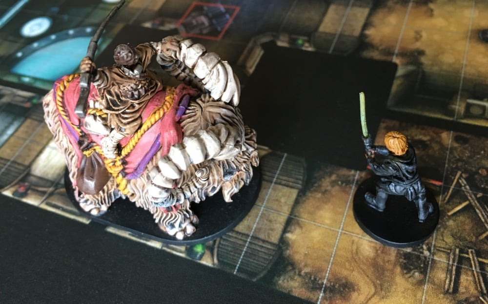
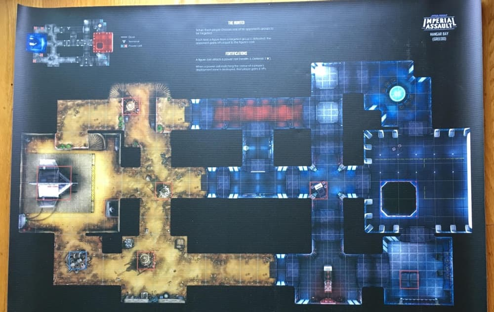

# Imperial Assault Printable Skirmish Maps

[New Orders](https://neworders.xyz) and [Board Wars](http://boardwars.eu/) podcasts are working together to bring you the Imperial Assault Skirmish Map Project. The project continues the lovely work started by Ibsh to create beautiful images for every Imperial Assault Skirmish Map. These maps serve two purposes:

1. Skirmish maps have been added to the Boardwars.eu [Imperial Assault Image DB](http://cards.boardwars.eu/index.php?album=Skirmish-Maps) where they can be searched and referenced.
2. Printable map groups are available for the current Imperial Assault tournament rotation as well as a full download of all the maps for printing.

*To use these maps you must own the indicated Fantasy Flight Games product.*

### Background & Colophon

Project was started by Ibsh and popularized on [this FFG Thread](https://community.fantasyflightgames.com/topic/186906-pre-assembled-skirmish-maps/). After Ibsh stepped away, he kindly passed the source files on Nick (nickv2002 on the forums and one of the hosts of the [New Orders podcast](https://neworders.xyz/)). Nick worked with Stephan at [Boardwars.eu](http://boardwars.eu/) to integrate with their [Imperial Assault Image DB](http://cards.boardwars.eu/).

In addition to making high resolution maps, much care has gone into cleaning up these map images. The seams between tiles have been removed, but you’ll also find altered wording for clearer mission rules and some other subtle tweaks that we think improves the maps.

### Printing
These maps are created at 300 DPI so they can be easily printed at full size to make functional playmats.

* [All currently available maps](https://github.com/nickv2002/Imperial-Assault-Skirmish-Map-Project/tree/master/Combined_IA_Map_Sheets/All2PlayerMaps) or [the current tournament maps](https://github.com/nickv2002/Imperial-Assault-Skirmish-Map-Project/tree/master/Combined_IA_Map_Sheets/TournamenRotationISBAnchorheadJabba) are the most popular printouts
* There is also a [printable map set for each wave](https://github.com/nickv2002/Imperial-Assault-Skirmish-Map-Project/tree/master/Combined_IA_Map_Sheets).
* Recommended shop & product: [PixArtPrinting PVC Banners](https://www.pixartprinting.com/signage/banners-mesh/pvc-banner/)
* PixArtPrinting *does* print 300 DPI JPGs (created with this script), even though their website asks for PDFs.
* The JPG files are very large so some people have trouble seeing them on their computer. Give them some time if you have an older computer

### Frequently Asked Questions
* **What about the other maps from the Jabba’s Realm Wave?** We’re working on these but the new tiles led to extra work and the handoff from Ibsh to Nick has slowed this down.
* **What about the 4-Player maps?** We’re working on this but they’re a lower priority.
PixartPrinting asks for PDFs, why do you only JPGs? They will also accept 300 DPI JPEG files. The map pictured above was printed this way. It’s easier to work with JPEG files.
* **How can I create some other mix of printable maps?** Maps are broken into different runs to make ordering those groups easier (this includes an incomplete group for Jabba’s Realm). Otherwise, the source code & files are all available as part of this GitHub project.
* **Who’s credited for making these maps?** All the maps predating Jabba’s Realm and the Jabba’s Palace map were made by Ibsh. The few other were made by Nick with help from Ibsh’s original scans.
* **I found an mistake in the maps.** Please double check with the rules and original map insert. After confirming, please [Create an Issue](https://github.com/nickv2002/Imperial-Assault-Skirmish-Map-Project/issues/new) on GitHub or let Nick know at the contact info below.

### Questions?
For questions about the maps or printing please create an issue ticket here or contact Nick ([FFG Forums](https://community.fantasyflightgames.com/profile/260007-nickv2002/), [Twitter](https://twitter.com/ianeworders), or nickv2002 on the [BoardWars Discord](http://discord.me/bweu)). For questions about the BoardWars Image Database please [contact Stephan](http://boardwars.eu/about/).
